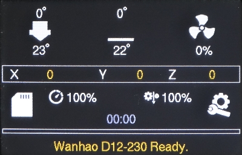

# Wanhao D12 Community Firmware

A [Marlin 3D Printer Firmware](https://github.com/MarlinFirmware/Marlin) for [Wanhao Duplicator 12 3D Printers](https://wanhao-europe.com/), based on [NeoprodFX](https://www.lesimprimantes3d.fr/forum/topic/40174-nouveau-firmware-marlin-2-pour-d12230-par-neoprodfx/)'s [fork](https://drive.google.com/drive/folders/1cvzLbvTxFYpviszKdxxuEIhQ1w8liWoC).

**Features**

* Classic [TFT_COLOR_UI](https://www.lesimprimantes3d.fr/forum/topic/40717-tuto-firmware-personnalis%C3%A9-wanhao-d12-comment-compiler-son-firmware/) with all features unlocked
* Recolored UI for clarity and matching Wanhao printer line
* Support for MKS v1.2, 1.3, 3.0 motherboards
* Support for D12-230, 300, 500
* Support for 3D touch leveling
* Support for Direct Drive extruder
* Support for Dual Extruder
* Support for replacing drivers with TMC2209
* Maintenance menu: Autoleveling, filament load and unload
* Improve [3D touch reliability](https://www.lesimprimantes3d.fr/forum/topic/16676-am%C3%A9liorer-la-fiabilit%C3%A9-du-3dtouch/) in autoleveling procedure
* Example Start/End gcode for using in slicer

_Tested on D12-230 with v1.2 motherboard, 3D touch, Single regular extruder._

**ToDo List**

* Enable and configure filament change gcode (M600)

**Known issues**

* No Wi-Fi support on TFT_COLOR_UI

## Download

Have a look at the [Releases section](https://github.com/ORelio/Wanhao-Marlin-Firmware/releases) to get a build.

Currently, I can only provide a working build for my own configuration, which is:

* D12-230 / MKS v1.2 / 3D Touch

Have successfully built and tested a different firmware configuration? Let me know and I will add it.

## Build Instructions

To build your own version of the firmware, see [COMPILING.md](COMPILING.md).

## Usage

Once you have the firmware installed, see [USERGUIDE.md](USERGUIDE.md).

## License

The project is licensed under GPLv3. See [License](LICENSE).